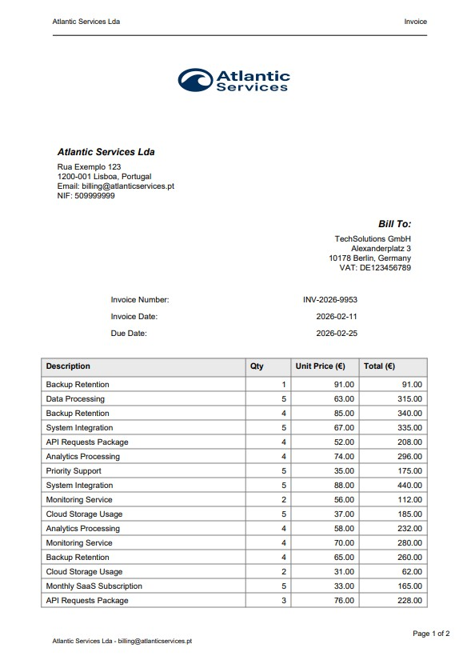
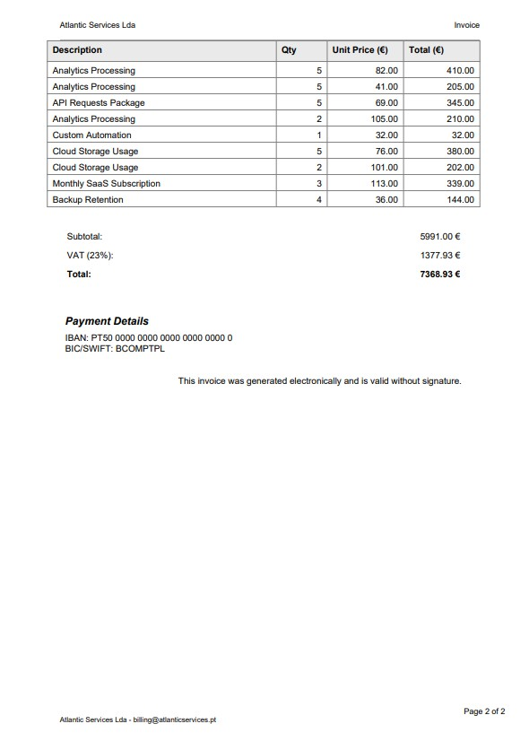

# Python Invoice PDF Generator

Generate professional, branded PDF invoices directly from Python using ReportLab.

This project is a **production-style example** of how to create invoices automatically for:

* SaaS platforms
* subscription billing
* marketplaces
* freelancers
* internal business tools




## Why this exists

Generating invoices sounds easy… until you actually need it in production.

Typical problems:

* HTML to PDF tools break layouts
* Stripe invoices are not customizable enough
* Word templates don't scale
* libraries have poor documentation

This repository shows a clean, maintainable way to generate invoices **directly in Python code**, with full layout control and zero external dependencies.


## Quick Start

```bash
git clone https://github.com/hasff/python-invoice-pdf-generator.git
cd python-invoice-pdf-generator
python -m venv venv
source venv/bin/activate   # Windows: venv\Scripts\activate
pip install -r requirements.txt
python generate_invoice.py
```

The script will create:

```
output/invoice_sample.pdf
```

## Need custom PDF generation?

I help companies automate document generation:

* invoices
* certificates
* reports
* labels
* batch exports
* integration with APIs and databases

Typical use cases:

* SaaS billing systems
* automated emailing
* ERP integrations
* internal dashboards

📩 Contact: hugoferro.business(at)gmail.com
<!-- 🌐 Portfolio: https://hasff.github.io/site/ -->

## Further Learning

This repository demonstrates a real-world style invoice generator built with ReportLab.
It is intentionally kept simple and usable, but it is based on techniques I developed while working on client PDF automation projects.

If you want a complete, structured walkthrough of how systems like this are designed and extended, I cover it in my full course:

[**Python PDF Generation: From Beginner to Winner (ReportLab)**](https://www.udemy.com/course/python-reportlab-from-beginner-to-winner/?referralCode=3B927E883D2E868CF221)


In the course you will learn:

* layout and pagination strategies
* working with TrueType fonts and branding
* images and watermarks
* PDF forms (checkboxes, radio buttons, dropdowns, text fields)
* document protection and permissions
* exporting PDFs from a Django application
* how to structure readable and maintainable production code

The course is optional — the repository is fully usable on its own — but it provides deeper understanding of the architectural decisions behind this example.
